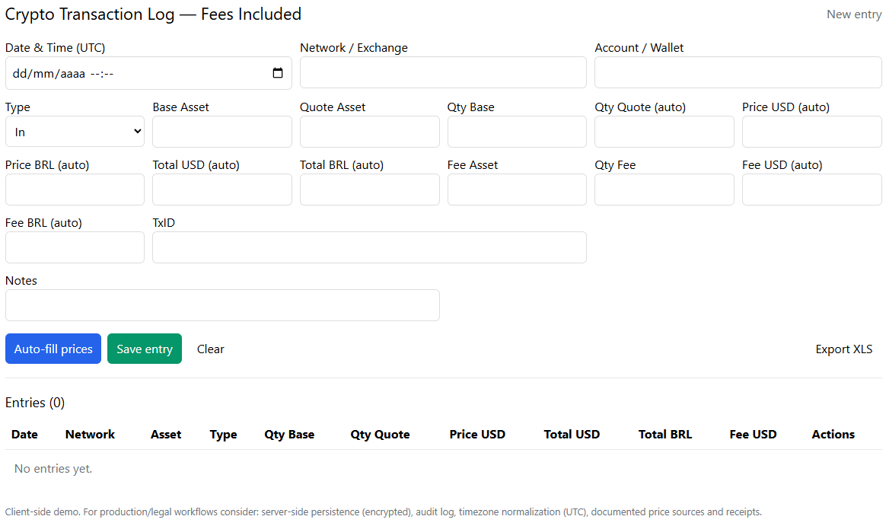

# 📒 Crypto Transaction Log

A simple web application for recording and exporting cryptocurrency transactions.  
Built with **Next.js** to help users maintain organized records for portfolio tracking and tax/compliance purposes.

**Requires:**
- **Node.js 20+**
- **npm**, **yarn**, or **pnpm**
- Internet connection for historical price fetching

🧪 Demo available in https://crypto-transaction-log-rdlsc.vercel.app/


## 🔥 Features

- Manual input of all transaction data (date, time, assets, amounts, fees, notes)
- Automatic historical price lookup using **Binance API**
- Editable entries (edit, delete)
- Copy a transaction row directly into Excel (tab-separated, with headers)
- Export all transactions as an **Excel-compatible .xls** file
- Local persistence using `localStorage`
- Fully client-side — backend not required

## 🚀 Installation and Running

```sh
git clone https://github.com/leocairos/crypto-transaction-log.git
cd crypto-transaction-log
npm install
npm run dev
```

The application will be available at:

http://localhost:5173

<p align="center">
    
</p>

## 📝 Notes

This project is intended as a client-side tool.

For professional, accounting, or compliance environments, consider adding:
- Secure server-side storage
- User authentication
- Immutable audit logs
- Timezone normalization (UTC)
- API request throttling and logging

## 📄 License

Code released under the [MIT License](./LICENSE).

Make by [Leonardo Cairo](https://www.linkedin.com/in/leocairos/)!